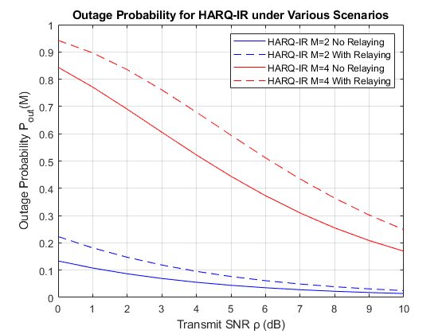
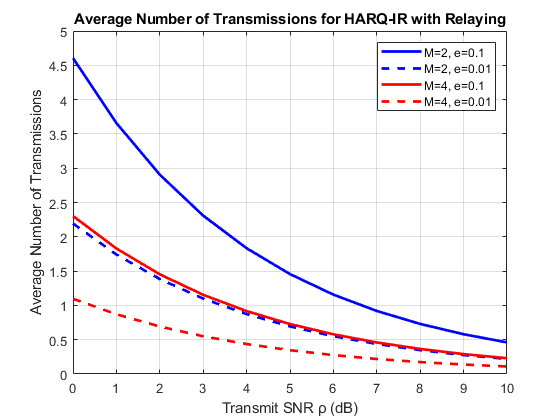
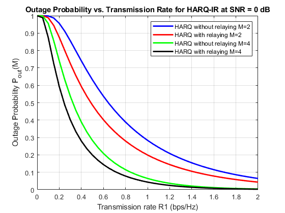
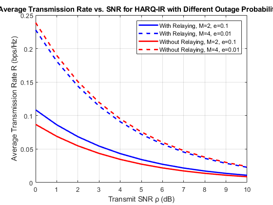

# Performance of Hybrid-ARQ with Incremental Redundancy over Relay Channels

# Công thức tổng quát
Tất cả kiến thức được sử dụng tại bài báo trong thư mục paper của dự án.

# Xây dựng mô hình
## System outage probability Pout(M) of HARQ-IR with and without relaying for R1 = 1 bps/Hz.

#### Các hằng số

| I/P Parameters	 | Value 2 |
| -------- | -------- | 
| e:# Fixed target outage probability     | 0.01     | 
| rates_M2:# Rates for HARQ without and with relaying when M=2     | [0.1, 0.25]     | 
| rates_M4:# Rates for HARQ without and with relaying when M=4     | [0.55, 1.05]     | 
| snr_dB_range:# SNR values from 0 to 10 dB     |  0:1:10     | 

#### Variable Data structure
| Variable | Meaning  | Data Type| range   |
| -------- | -------- | -------- |-------- |

#### Output Data structure
| O/P | Meaning  | Data Type| range   |
| -------- | -------- | -------- |-------- |

##  Average number of transmissions of HARQ-IR with relaying for different target outage probabilities e .
#### Các hằng số

| I/P Parameters	 | Value 2 |
| -------- | -------- | 

#### Variable Data structure
| Variable | Meaning  | Data Type| range   |
| -------- | -------- | -------- |-------- |

#### Output Data structure
| O/P | Meaning  | Data Type| range   |
| -------- | -------- | -------- |-------- |

## System outage probability Pout(M) versus transmission rate R1 for a transmit SNR ρ = 0 dB.

#### Các hằng số

| I/P Parameters	 | Value 2 |
| -------- | -------- | 

#### Variable Data structure
| Variable | Meaning  | Data Type| range   |
| -------- | -------- | -------- |-------- |

#### Output Data structure
| O/P | Meaning  | Data Type| range   |
| -------- | -------- | -------- |-------- |

## Average transmission rate of HARQ-IR with relaying for different target outage probabilities e.
#### Các hằng số

| I/P Parameters	 | Value 2 |
| -------- | -------- | 

#### Variable Data structure
| Variable | Meaning  | Data Type| range   |
| -------- | -------- | -------- |-------- |

#### Output Data structure
| O/P | Meaning  | Data Type| range   |
| -------- | -------- | -------- |-------- |

# Result
#### Các kết quả thu lại từ Matlab
  
*Fig. 1 System outage probability Pout(M) of HARQ-IR with and without relaying for R1 = 1 bps/Hz*  
  
*Fig. 2 Average number of transmissions of HARQ-IR with relaying for different target outage probabilities e*  

  
*sFig. 3 System outage probability Pout(M) versus transmission rate R1 for a transmit SNR ρ = 0 dB*  
  
*Fig. 4 Average transmission rate of HARQ-IR with relaying for different target outage probabilities e*  
